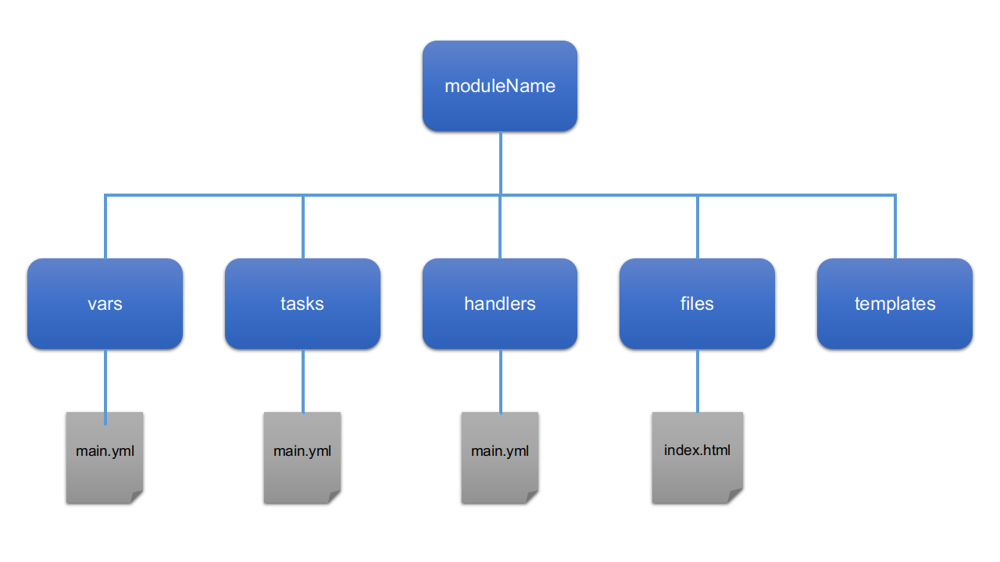

# Ansible playbook to Ansible role

This folder takes a basic playbook and shows the sections converted into an Ansible role which can then be published on Ansible Galaxy or Git.

# basic.yml file

This file is the basic playbook, which is a self-contained playbook having the sections necessary to provision a host with Apache web server.

The main sections in this file are;
* hosts
* vars
* tasks

Sections that this playbook does not contain are;
* files
* templates
* handlers

If your playbook contains a handler then you will see the word **handler** in the code and this would require the creation of the **handlers** directory in the same way as you'll see shortly for the vars and tasks.

**Files** are less obvious, but if you have a copy command in your playbook that contains the **src** and **dest** attributes then you'll need to have a directory called **files**.

If you have the **template** module specified in the playbook then the location of your template will live in a folder called **templates**.

# The module

Diagram of the modules directory.


The *moduleName* in our example is the directory called *apacheModule*.

Within the module directory you'll see the folders that take their names from the sections within your playbook.

The folders that perform specific actions;
* vars
  - Contains all the variables that the users of your module could change
* tasks
  - The actions to perform to provision
* handlers
  - Actions that are based on events happening in your tasks, e.g. restarting the service on a configuration change.

Must have a file inside them called **main.yml** as Ansible looks for this file as the entry point of your code.  You'll also notice that inside these files we just start the coding.  For example, the **vars:** section in the single playbook;
```
vars:
  docroot: /var/www/html
```
And in the main.yml under the vars directory;
```
docroot: /var/www/html
```

The **files** and **templates** folders will have files named as per your code **src** requirements.

Templates require the .j2 extension to inform Ansible that you are using Jinja2 formatting.

NOTE: In our example we do not have a handlers folder.

# The hosts
When using an Ansible role there is no hosts section since this is placed in the person using your module playbook.  So to use the module a user would create their own *site.yml* for example;

```
- hosts: web
  connection: local
  gather_facts: true
  roles:
    - apacheModule
```

As well as their own hosts file;

```
[web]
local ansible_host=127.0.0.1 ansible_connection=local
```
